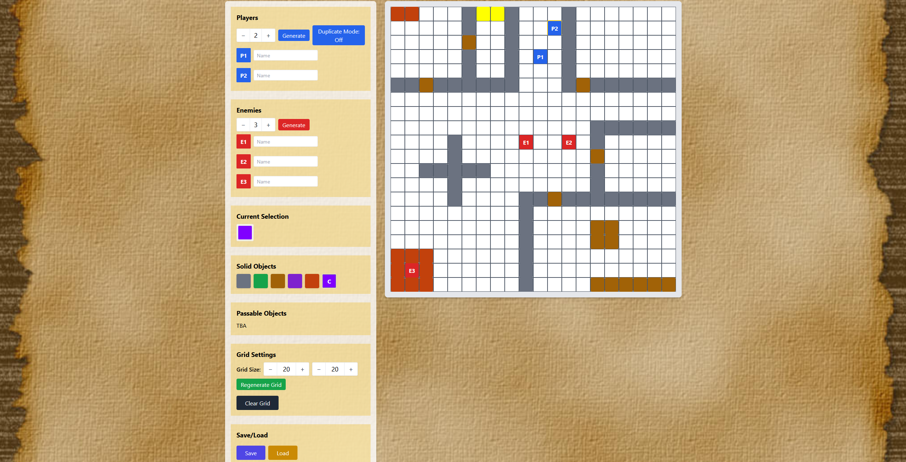

# D&D Board Project

A tool made mainly for DnD DMs. It allows them to visualize their fantastic map layout in an HTML page which they can share with others, preferably through a share screen functionality.

It is to be re-written in Vue.js along with additional server-side interaction

The user may:

1. Adjust the number of Players and Enemies of the session
2. Set distinguished names for identification purposes to each character present on the board
3. Place said entities on the board
4. Adjust the size of the map grid
5. Create interesting map layouts by clicking or drawing on the map grid. Maps are made up of solid and passable objects such as walls, water, fire, floor tiles etc. represented by different colors (no textures yet)
6. Save/Load a map's state through the use of JSON files

Sample Screenshot:

Usage instructions:

Download the project, open the index.html on the browser and voila, you have a D&D board

This project was created for fun and personal use in tabletop sessions.

Not for commercial use.  
Do not redistribute, modify, or publish this without permission.

© 2025 Jamessks. All rights reserved.
